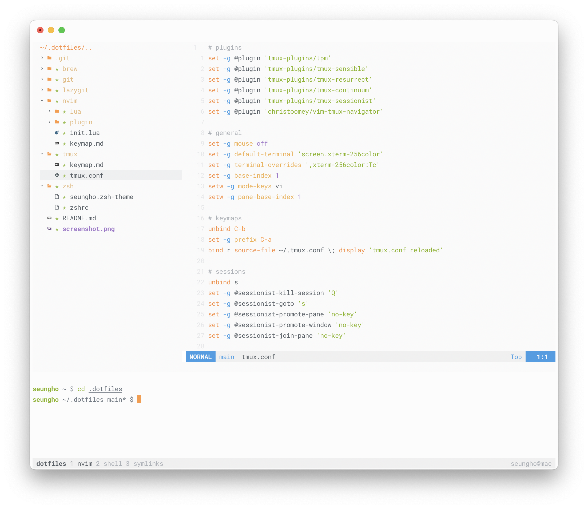

# dotfiles



Personal dotfiles for brew, git, lazygit, nvim, tmux, zsh in Linux/macOS.

## Prerequisites

Install below tools before applying dotfiles.

- brew(macOS) https://brew.sh
- git https://git-scm.com
- lazygit https://github.com/jesseduffield/lazygit
- neovim https://github.com/neovim/neovim
- tmux https://github.com/tmux/tmux
- zsh https://github.com/ohmyzsh/ohmyzsh/wiki/Installing-ZSH
- oh-my-zsh https://github.com/ohmyzsh/ohmyzsh
- asdf https://asdf-vm.com/guide/getting-started.html

## Installation

Clone this repository and apply dotfiles.

```
git clone git@github.com:llistnr/dotfiles.git ~/.dotfiles

# Install brew packages(macOS)
brew bundle

# Create symbolic links
ln -s ~/.dotfiles/git/gitconfig ~/.gitconfig
ln -s ~/.dotfiles/lazygit/config.yml ~/.config/lazygit/config.yml
ln -s ~/.dotfiles/tmux/tmux.conf ~/.tmux.conf
ln -s ~/.dotfiles/nvim ~/.config/nvim
ln -s ~/.dotfiles/zsh/zshrc ~/.zshrc
ln -s ~/.dotfiles/zsh/seungho.zsh-theme ~/.oh-my-zsh/themes/seungho.zsh-theme
```

## Terminal Fonts

Roboto Mono Nerd Font: https://github.com/ryanoasis/nerd-fonts/tree/master/patched-fonts/RobotoMono

## Terminal Colorscheme

Gogh: https://gogh-co.github.io/Gogh/

```
bash -c  "$(wget -qO- https://git.io/vQgMr)"    # Linux
bash -c  "$(curl -sLo- https://git.io/vQgMr)"   # macOS
14  # for ayu-light colorscheme
```

